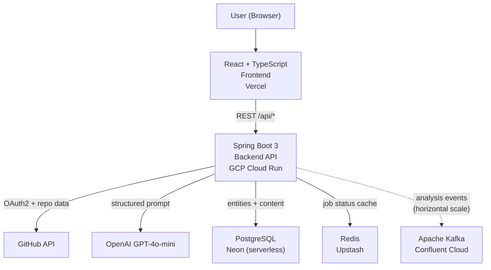
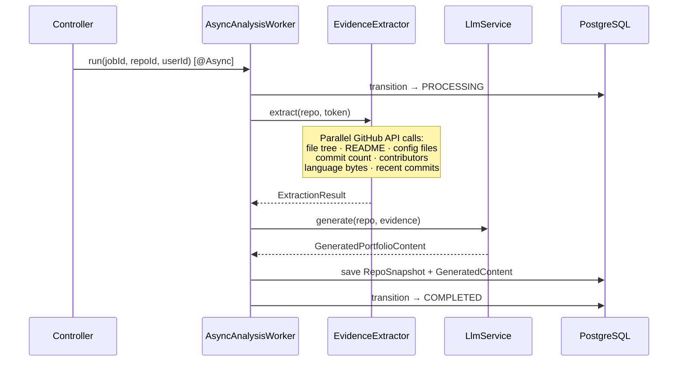
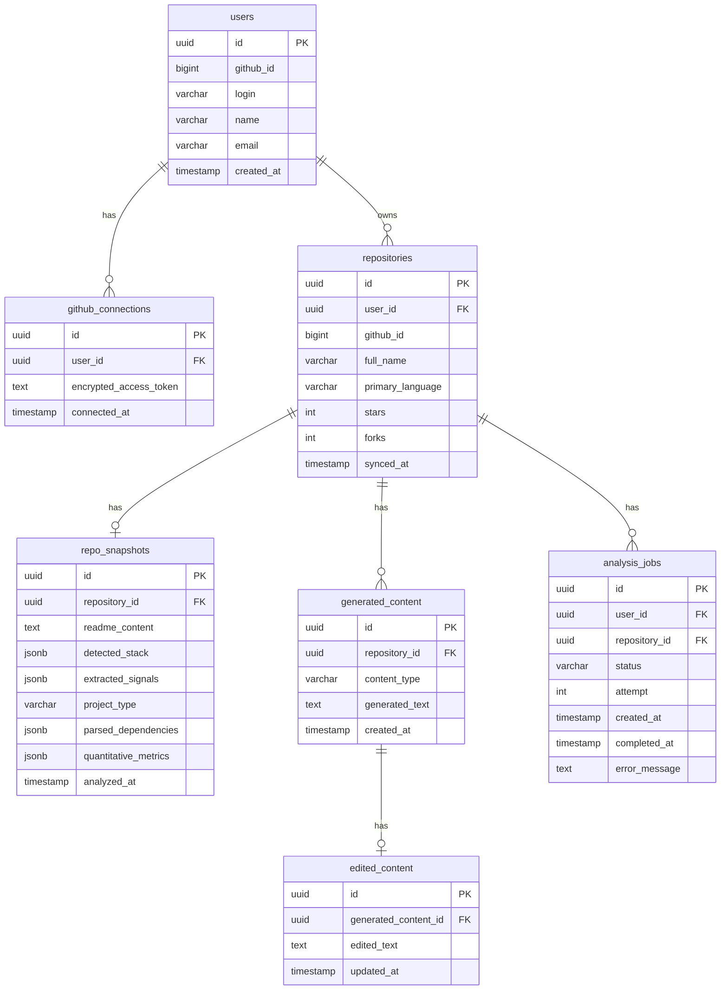
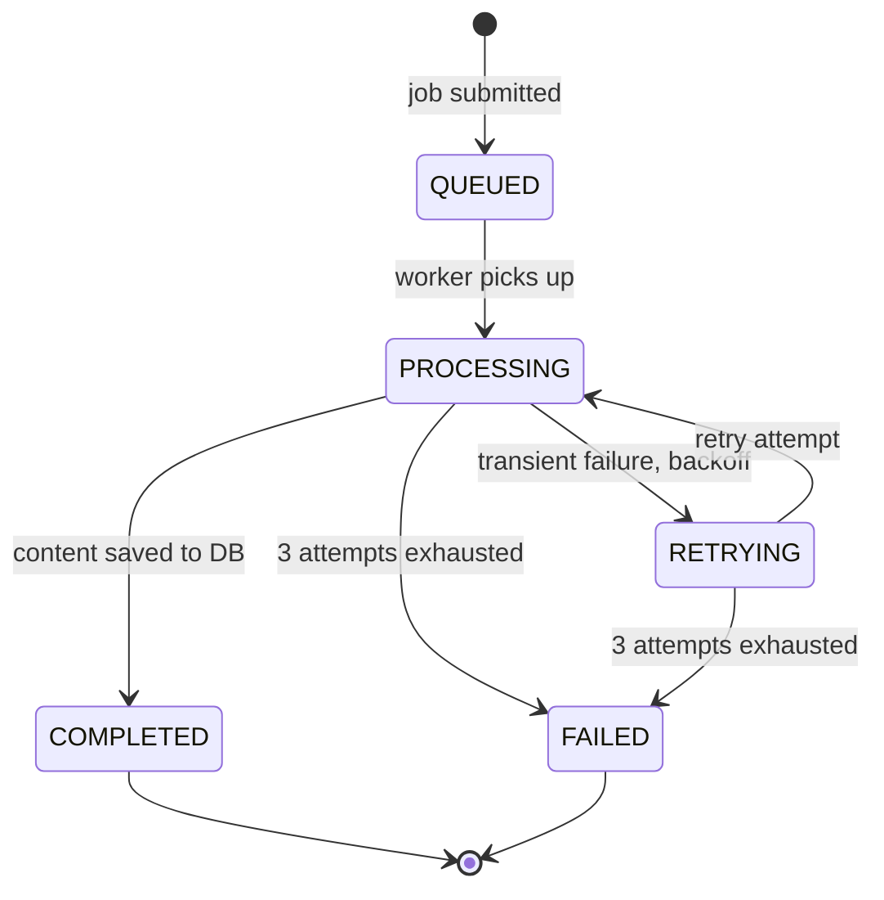

# GitHub Portfolio Intelligence Platform


A developer tool that analyzes GitHub repositories and generates recruiter-ready portfolio content — resume bullets, portfolio summaries, and interview narratives — by extracting structured evidence from build files, commit history, and GitHub API signals before calling the LLM.

**Live:** [github-to-portfolio-neon.vercel.app](https://github-to-portfolio-neon.vercel.app) · Backend: GCP Cloud Run · DB: Neon · Cache: Upstash Redis

---

## The Core Idea

Most portfolio generators pass the README to an LLM and hope for the best. This system does something different: before any AI call, it fetches and parses `pom.xml`, `package.json`, `Dockerfile`, GitHub Actions workflows, commit messages, contributor counts, and language bytes — then builds a structured `RepoSnapshot` with typed fields. The LLM receives a prompt filled with concrete facts, not vibes.

---

## System Architecture



---

## Analysis Pipeline

Analysis jobs run on a Spring `@Async` thread pool (`analysisExecutor`, core=3, max=6). Each job executes three phases in sequence — evidence extraction, LLM generation, and persistence — with automatic retry (up to 3 attempts, exponential backoff).



A Kafka pipeline (`ExtractionStageConsumer` → `GenerationStageConsumer` → `PersistenceStageConsumer`) is implemented for horizontal scaling scenarios where multiple Cloud Run instances process jobs independently. On the current single-instance deployment, the `@Async` path is used to avoid Kafka consumer group rebalancing overhead on cold starts.

---

## Evidence Extraction Engine

The extraction engine collects signals from seven GitHub API endpoints concurrently and parses them into a typed `RepoSnapshot` before any LLM call.


---

## Data Model



---

## Job State Machine



Job status is written to **both Redis and PostgreSQL** on every transition:
- **Redis** — O(1) reads for the frontend polling loop (24h TTL). Terminal states (COMPLETED/FAILED) always read from DB to prevent stale cache overrides.
- **PostgreSQL** — durable history, source of truth after Redis eviction

---

## Tech Stack

| Layer | Technology |
|---|---|
| Frontend | React 19, TypeScript, Vite, Tailwind CSS v4, TanStack Query |
| Backend | Spring Boot 3.5, Java 21, Spring Security (OAuth2), Spring Data JPA |
| Database | PostgreSQL (Neon serverless), Flyway (7 migrations) |
| Cache / Job State | Redis (Upstash) |
| Messaging | Apache Kafka (Confluent Cloud, SASL/SSL) |
| LLM | OpenAI GPT-4o-mini via openai-java SDK |
| Containerization | Docker (multi-stage build), Docker Compose (local dev) |
| Infrastructure | GCP Cloud Run, Artifact Registry, Terraform |
| Frontend Hosting | Vercel |
| CI/CD | GitHub Actions (backend: test + build; frontend: typecheck + lint + build) |

---

## Production Deployment

The app runs on free-tier infrastructure:

| Service | Provider | Notes |
|---|---|---|
| Backend | GCP Cloud Run | Scale-to-zero, 1 GiB RAM, `prod` Spring profile |
| Frontend | Vercel | Static SPA, SPA catch-all rewrite |
| Database | Neon | Serverless Postgres, connection pooling |
| Redis | Upstash | Session store + job state cache, TLS |
| Kafka | Confluent Cloud | SASL PLAIN over SSL |

### Deploy from scratch

**Prerequisites:** GCP project, Neon DB, Upstash Redis, Confluent Cloud Kafka, GitHub OAuth App, OpenAI API key.

```bash
# 1. Configure
cp infra/terraform.tfvars.example infra/terraform.tfvars
# fill in all values

# 2. Auth + init
make setup

# 3. Create Artifact Registry, build image, deploy Cloud Run
make first-deploy

# 4. Copy the Cloud Run URL into terraform.tfvars as backend_url, then:
make deploy
```

### Redeploy after code changes

```bash
make push    # build + push :latest to Artifact Registry
gcloud run deploy portfolio-backend \
  --image us-central1-docker.pkg.dev/<project>/portfolio-backend/backend:latest \
  --region us-central1 --project <project>
```

---

## Local Development

### Prerequisites

- Docker + Docker Compose
- A GitHub OAuth App ([create one](https://github.com/settings/developers))
  - Homepage URL: `http://localhost:3000`
  - Callback URL: `http://localhost:8080/login/oauth2/code/github`
- An OpenAI API key

### 1. Configure environment

Create `backend/.env`:

```env
GITHUB_CLIENT_ID=your_github_oauth_app_client_id
GITHUB_CLIENT_SECRET=your_github_oauth_app_secret
TOKEN_ENCRYPTION_KEY=<run: openssl rand -base64 32>
LLM_API_KEY=your_openai_api_key
POSTGRES_PASSWORD=portfolio_dev
```

### 2. Start infrastructure + run services

```bash
# Start postgres + redis + kafka
docker compose up -d

# Terminal 1 — backend
cd backend && ./mvnw spring-boot:run

# Terminal 2 — frontend
cd frontend && npm install && npm run dev
```

Open [http://localhost:3000](http://localhost:3000)

### 3. Full Docker stack

```bash
docker compose --profile full up --build
```

---

## API Reference

| Method | Path | Description |
|---|---|---|
| `GET` | `/api/me` | Current authenticated user |
| `POST` | `/api/repos/sync` | Sync GitHub repositories |
| `GET` | `/api/repos` | List synced repositories |
| `POST` | `/api/repos/analyze/batch` | Submit batch analysis |
| `POST` | `/api/repos/{repoId}/analyze` | Reanalyze a single repo |
| `GET` | `/api/jobs` | Paginated job list |
| `GET` | `/api/jobs/{jobId}` | Poll single job status |
| `GET` | `/api/projects` | All analyzed projects (workspace) |
| `GET` | `/api/projects/{repoId}/content` | Generated content for a repo |
| `PUT` | `/api/projects/{repoId}/content/{id}` | Save inline edit |

---

## Key Engineering Decisions

**Why separate evidence extraction from LLM generation?**
Without structured evidence, the LLM hallucinates specifics and produces generic bullets. By parsing `pom.xml` for dependency counts, commits for feature signals, and the GitHub API for contributor and language data, the prompt contains concrete facts. The model's job becomes formatting, not guessing.

**Why parallelize GitHub API calls?**
The extraction phase makes 8–12 GitHub API calls (README, file tree, config files, commit count, contributors, language bytes, recent commits). Running them sequentially adds 3–5 seconds of pure wait time. Using `CompletableFuture.allOf()` for the independent calls (everything except file tree, which gates config parsing) cuts extraction to ~1–2 seconds.

**Why `@Async` instead of the Kafka pipeline on Cloud Run?**
The Kafka pipeline was designed for horizontal scaling: independent consumer groups let each stage (extraction, generation, persistence) scale and retry separately. On a single Cloud Run instance with scale-to-zero, though, all four consumer groups rebalance with Confluent Cloud on every cold start — each taking 30–60 seconds. That overhead makes the first analysis after an idle period take 2–4 minutes before any work starts. The `@Async` worker runs the full pipeline on a local thread pool (no network round-trips for job dispatch), and the Kafka infrastructure remains in place for when horizontal scaling is needed.

**Why dual-write to Redis and PostgreSQL for job state?**
Redis makes frontend polling cheap (no DB query per poll, O(1) key lookup). PostgreSQL ensures job history survives Redis eviction. Terminal states (COMPLETED/FAILED) always read from the DB so that manual resets via SQL are immediately reflected without waiting for Redis TTL expiry.

**Why cross-origin session cookies instead of JWTs?**
The frontend (Vercel) and backend (Cloud Run) are on different origins. JWTs would require storing the token client-side and managing rotation. Instead, the backend uses `SameSite=None; Secure` session cookies backed by Redis (`spring-session-data-redis`), which survive Cloud Run scale-to-zero restarts and work naturally with Spring Security's existing OAuth2 session management.

---

## Project Structure

```
github-to-portfolio/
├── backend/
│   ├── src/main/java/com/portfolio/backend/
│   │   ├── config/          # Security, async executor, app config
│   │   ├── controller/      # REST endpoints
│   │   ├── entity/          # JPA entities + enums
│   │   ├── kafka/           # Topics, publisher, stage consumers, events
│   │   ├── repository/      # Spring Data JPA repositories
│   │   └── service/         # Analysis, evidence extraction, LLM, job state
│   └── src/main/resources/
│       ├── application.yml  # local / docker / staging / prod profiles
│       └── db/migration/    # Flyway V1–V7
├── frontend/
│   ├── src/                 # React + TypeScript
│   └── vercel.json          # SPA catch-all rewrite
├── infra/
│   ├── main.tf              # GCP Cloud Run + Artifact Registry
│   ├── variables.tf
│   ├── outputs.tf
│   └── terraform.tfvars.example
├── Makefile                 # setup · push · deploy · url targets
├── .github/workflows/       # Backend + frontend CI
└── docker-compose.yml       # Full local stack
```
