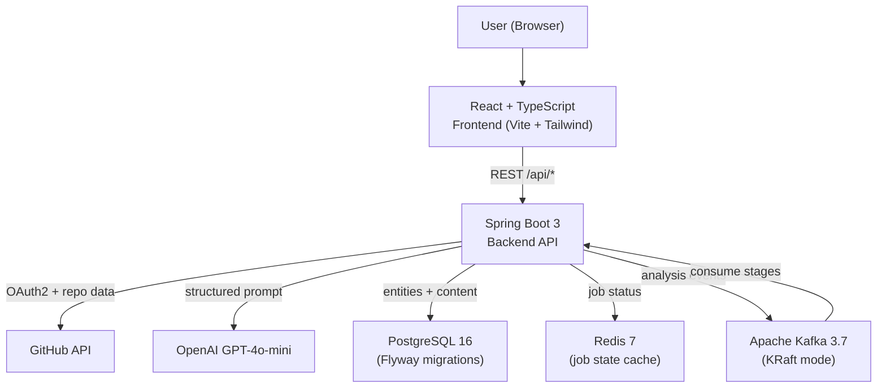
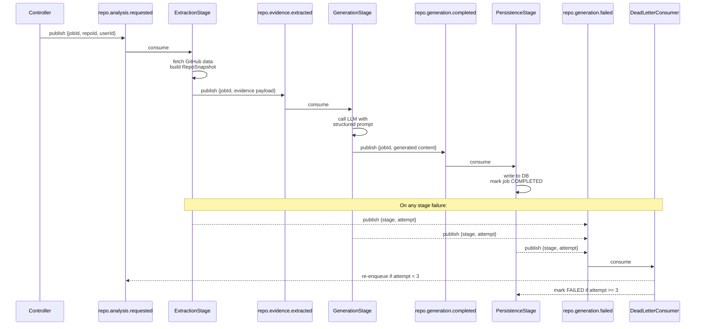
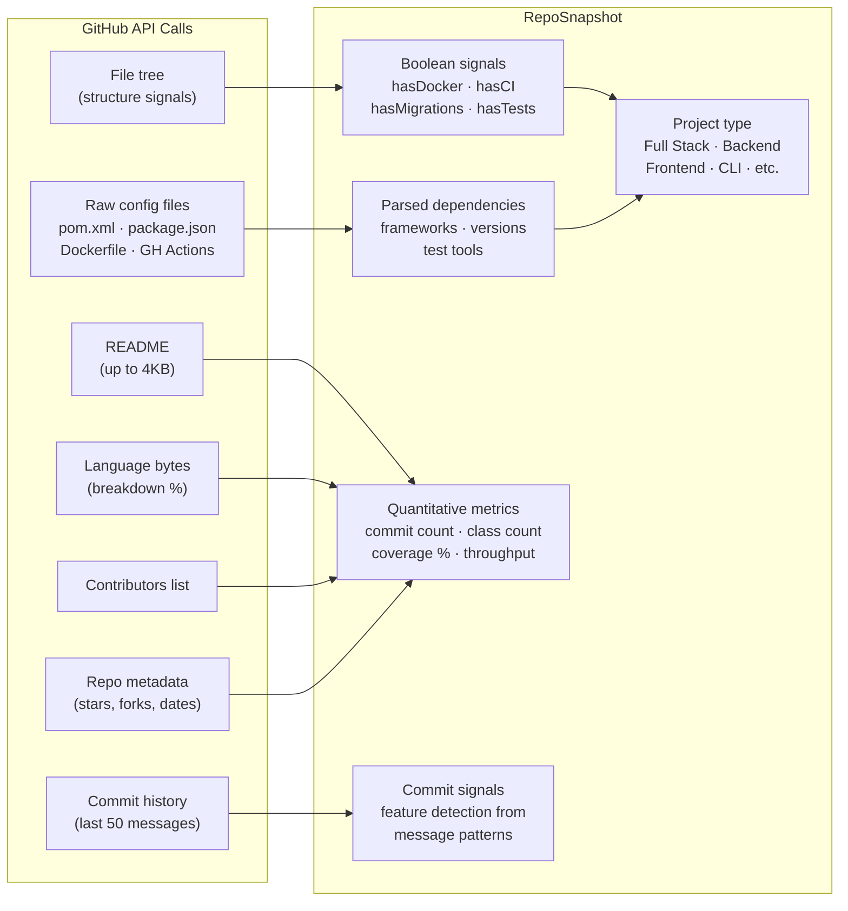
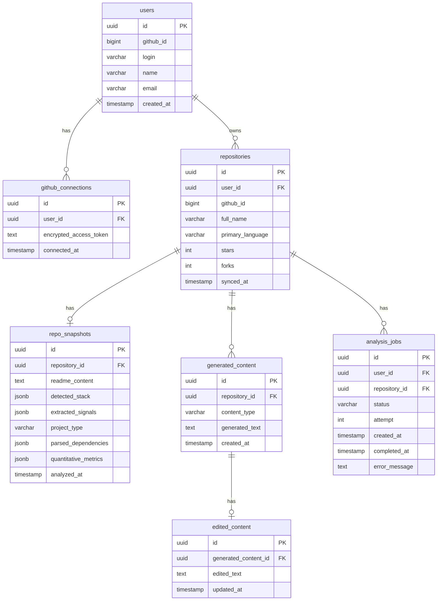
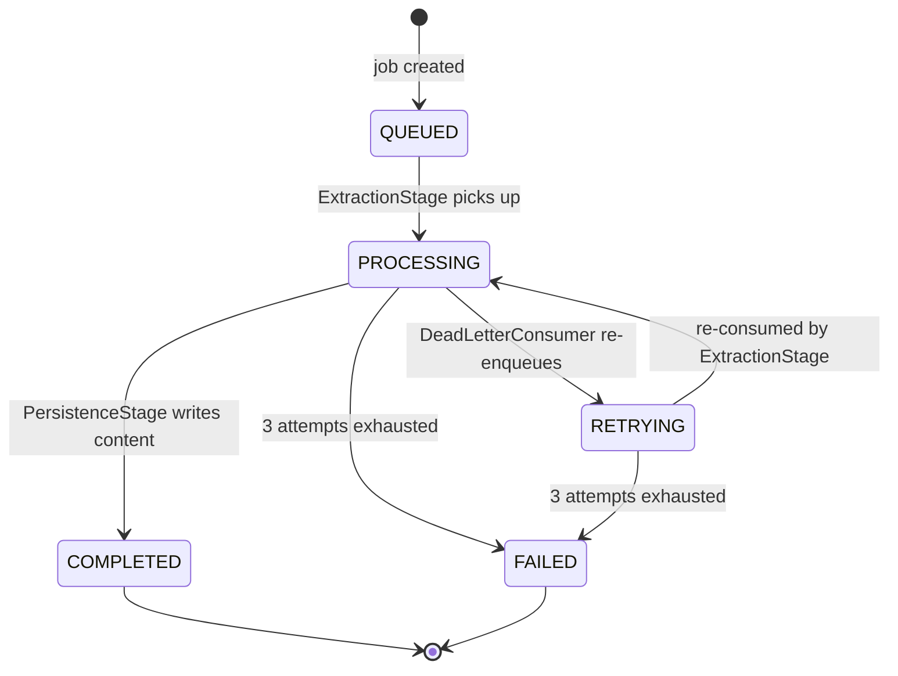

# GitHub Portfolio Intelligence Platform

A developer tool that analyzes GitHub repositories and generates recruiter-ready portfolio content — resume bullets, portfolio summaries, and interview narratives — by extracting structured evidence from build files, commit history, and GitHub API signals before calling the LLM.

Built as a flagship portfolio project demonstrating full-stack engineering, async job processing, event-driven architecture, and production-grade backend design.

---

## The Core Idea

Most portfolio generators pass the README to an LLM and hope for the best. This system does something different: before any AI call, it fetches and parses `pom.xml`, `package.json`, `Dockerfile`, GitHub Actions workflows, commit messages, contributor counts, and language bytes — then builds a structured `RepoSnapshot` with typed fields. The LLM receives a prompt filled with concrete facts, not vibes.

---

## System Architecture



---

## Kafka Analysis Pipeline

The analysis pipeline is split into four independent stages communicating via Kafka topics. Each stage runs in its own consumer group and can scale, retry, and fail independently.



---

## Evidence Extraction Engine

The extraction engine is the technical core. It collects signals from seven GitHub API endpoints and parses them into a typed `RepoSnapshot` before any LLM call.



---

## Data Model



---

## Job State Machine



Job status is written to **both Redis and PostgreSQL** on every transition:
- **Redis** — O(1) reads for the frontend polling loop (24h TTL)
- **PostgreSQL** — durable history, source of truth after Redis eviction

---

## Tech Stack

| Layer | Technology |
|---|---|
| Frontend | React 19, TypeScript, Vite, Tailwind CSS v4, TanStack Query |
| Backend | Spring Boot 3.5, Java 21, Spring Security (OAuth2), Spring Data JPA |
| Messaging | Apache Kafka 3.7 (KRaft — no Zookeeper) |
| Database | PostgreSQL 16, Flyway (7 migrations) |
| Cache / Job State | Redis 7 |
| LLM | OpenAI GPT-4o-mini via openai-java SDK |
| Containerization | Docker, Docker Compose (multi-stage builds) |
| CI/CD | GitHub Actions (backend: test + build + Docker; frontend: typecheck + lint + build) |

---

## Getting Started

### Prerequisites

- Docker + Docker Compose
- A GitHub OAuth App ([create one here](https://github.com/settings/developers))
  - Homepage URL: `http://localhost:3000`
  - Callback URL: `http://localhost:8080/login/oauth2/code/github`
- An OpenAI API key

### 1. Configure environment

Create `backend/.env`:

```env
GITHUB_CLIENT_ID=your_github_oauth_app_client_id
GITHUB_CLIENT_SECRET=your_github_oauth_app_secret
TOKEN_ENCRYPTION_KEY=<run: openssl rand -base64 32>
LLM_API_KEY=your_openai_api_key
POSTGRES_PASSWORD=portfolio_dev
```

### 2. Start infrastructure (dev mode — recommended)

```bash
# Starts postgres + redis + kafka only
docker compose up -d
```

Then run each service locally:

```bash
# Terminal 1 — backend
cd backend && ./mvnw spring-boot:run

# Terminal 2 — frontend
cd frontend && npm install && npm run dev
```

Open [http://localhost:3000](http://localhost:3000)

### 3. Full Docker stack

```bash
docker compose --profile full up --build
```

---

## API Reference

| Method | Path | Description |
|---|---|---|
| `GET` | `/api/me` | Current authenticated user |
| `POST` | `/api/repos/sync` | Sync GitHub repositories |
| `GET` | `/api/repos` | List synced repositories |
| `POST` | `/api/repos/analyze/batch` | Submit batch analysis (returns job IDs) |
| `POST` | `/api/repos/{repoId}/analyze` | Reanalyze a single repo |
| `GET` | `/api/jobs/{jobId}` | Poll job status |
| `GET` | `/api/jobs` | Paginated job list |
| `GET` | `/api/projects` | All analyzed projects (workspace) |
| `GET` | `/api/projects/{repoId}/content` | Generated content for a repo |
| `PUT` | `/api/projects/{repoId}/content/{id}` | Save inline edit |

---

## Key Engineering Decisions

**Why separate evidence extraction from LLM generation?**
Without structured evidence, the LLM hallucinates specifics and produces generic bullets. By parsing `pom.xml` for dependency counts, commits for feature signals, and the GitHub API for contributor and language data, the prompt contains concrete facts. The model's job becomes formatting, not guessing.

**Why Kafka instead of `@Async` threads?**
`@Async` runs the full pipeline in one thread — extraction + generation + persistence fail or succeed together. Kafka decouples them: a transient GitHub API failure only retries the extraction stage, not the LLM call. Independent consumer groups also let each stage scale horizontally without touching others.

**Why dual-write to Redis and PostgreSQL for job state?**
Redis makes frontend polling cheap (no DB query per poll, O(1) key lookup). PostgreSQL ensures job history survives Redis eviction. The tradeoff is two writes per state transition — accepted because jobs transition infrequently (3–5 times total).

**Why carry evidence inline in Kafka events?**
Keeping evidence in the event message makes each consumer stateless — the generation stage needs no DB read to proceed. At this scale (hundreds of repos), 10–20 KB messages are acceptable. At higher volume, switching to S3/DB references would bound message size at the cost of an extra I/O hop.

---

## Project Structure

```
github-to-portfolio/
├── backend/
│   ├── src/main/java/com/portfolio/backend/
│   │   ├── config/          # Security, async, app config
│   │   ├── controller/      # REST endpoints
│   │   ├── entity/          # JPA entities + enums
│   │   ├── kafka/           # Topics, publisher, stage consumers, events
│   │   ├── repository/      # Spring Data JPA repositories
│   │   └── service/         # Analysis, evidence extraction, LLM, job state
│   └── src/main/resources/
│       ├── application.yml  # local / docker / staging / prod profiles
│       └── db/migration/    # Flyway V1–V7
├── frontend/src/            # React + TypeScript
├── .github/workflows/       # Backend + frontend CI
├── docker-compose.yml       # Full local stack
└── docs/
    ├── github_portfolio_action_plan.md
    ├── github_portfolio_spec.md
    └── interview_story.md   # Five-section interview narrative
```
